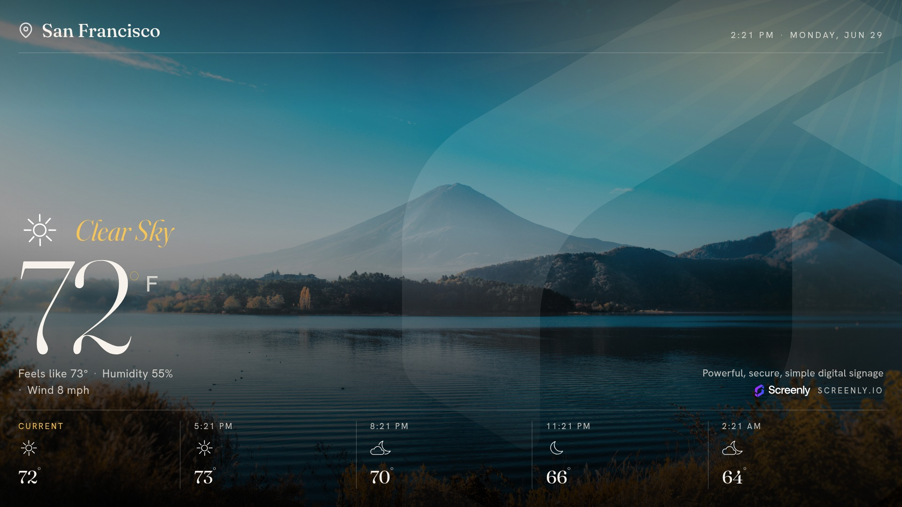

# Screenly Weather App



This is an example asset for Screenly as part of the [Screenly Playground](https://github.com/Screenly/playground).

You can view the live demo at [weather.srly.io](https://weather.srly.io/).

When running on a Screenly device with [asset metadata enabled](https://github.com/Screenly/playground/blob/master/asset-metadata/README.md), the location will automatically be set. If not, you can [this wizard](https://app-store.srly.io/weather/) to set your location.

## Requirements

This project uses [Bun](https://bun.sh/) as its package manager. Install dependencies with:

```bash
bun install
```

This installs [Wrangler](https://developers.cloudflare.com/workers/wrangler/) locally. Run it via `bunx wrangler` (or install it globally with `bun add -g wrangler`).

Login to Cloudflare

```bash
bunx wrangler login
```

Run the project in dev mode

```bash
bun run dev
```

Deploy worker

```bash
bunx wrangler deploy --env [environment name]
```
